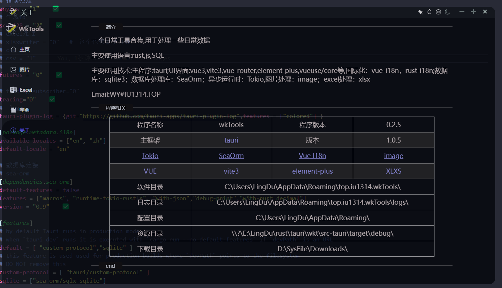
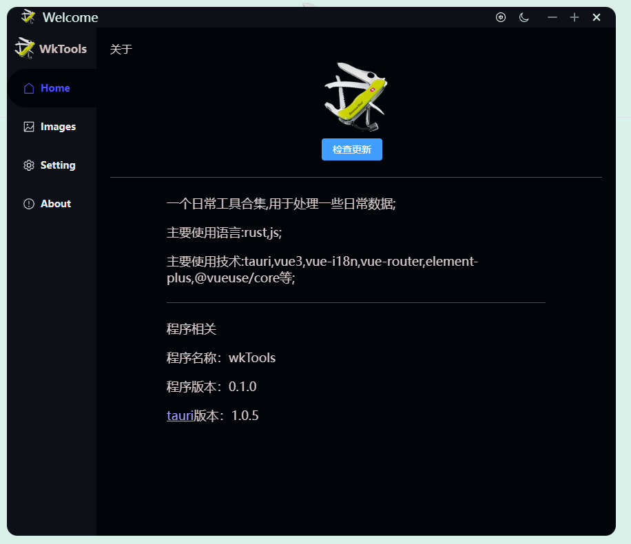
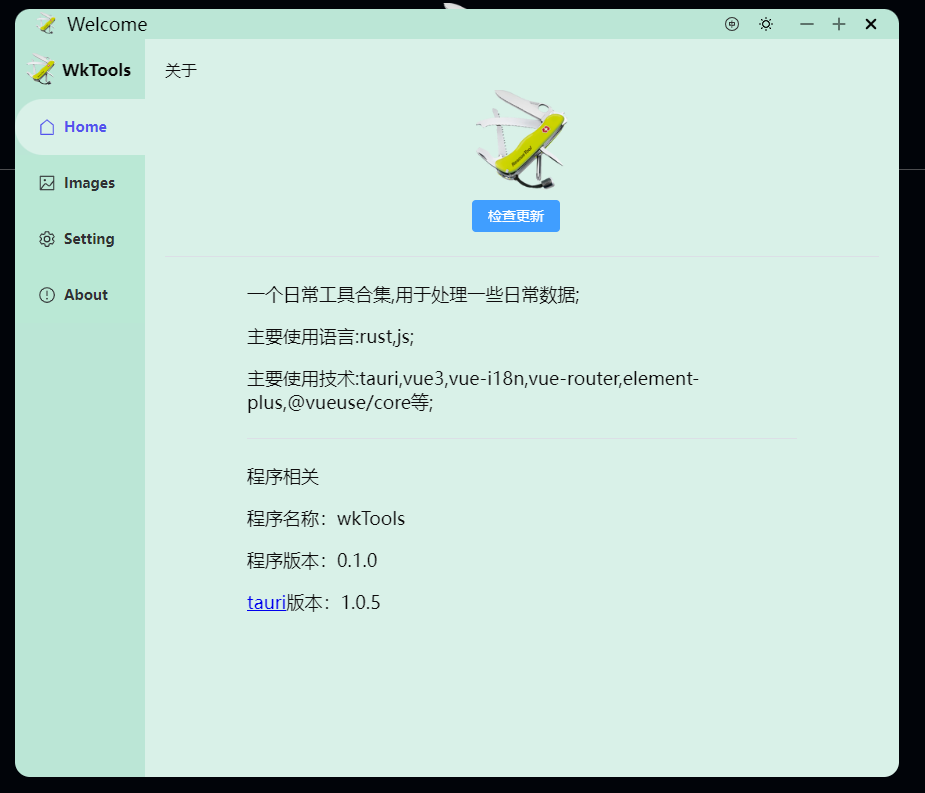
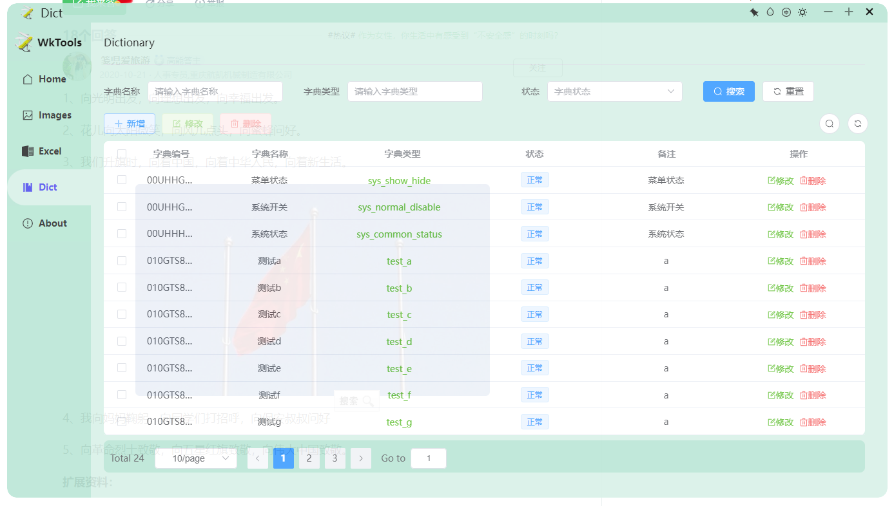

---

a tool  build with tauri,vue3

---

主要功能

---

rust 和 前端的 国际化

Internationalization of Rust and the front end

透明度调节

set the opacity of the app limited 0.600~1.000

黑暗模式，明亮模式调节

change the app theme mode(dark,light)

自动更新（tauri）

auto update by tauri

---

